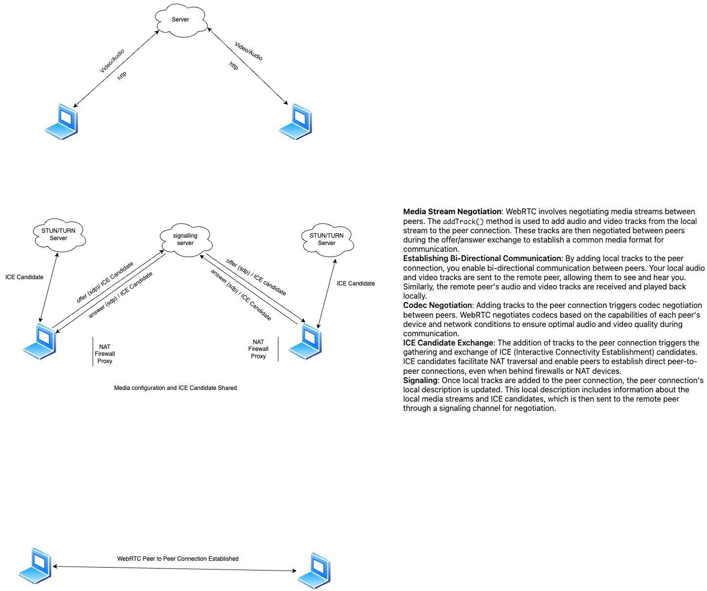

# WebRTC Media Stream Negotiation

WebRTC (Web Real-Time Communication) là một công nghệ mạnh mẽ cho phép truyền thông trực tiếp giữa các trình duyệt mà không cần máy chủ trung gian. Dưới đây là các bước chính trong quá trình thiết lập kết nối truyền thông hai chiều bằng WebRTC.

---

## 1. Media Stream Negotiation

WebRTC bắt đầu bằng việc đàm phán các luồng media giữa hai thiết bị. Phương thức `addTrack()` được sử dụng để thêm các track âm thanh và video từ stream cục bộ vào kết nối ngang hàng (`RTCPeerConnection`). Những track này sẽ được đàm phán trong quá trình trao đổi offer/answer nhằm xác định định dạng media chung giữa hai bên.

---

## 2. Establishing Bi-Directional Communication

Bằng việc thêm các track cục bộ vào kết nối, bạn kích hoạt khả năng giao tiếp hai chiều:

* **Gửi:** Track âm thanh và video của bạn được gửi đến peer từ xa.
* **Nhận:** Các track của peer từ xa sẽ được nhận và phát lại trên thiết bị của bạn.

---

## 3. Codec Negotiation

Việc thêm track sẽ kích hoạt quá trình đàm phán codec giữa hai peer. WebRTC chọn codec tối ưu dựa trên khả năng thiết bị và điều kiện mạng nhằm đảm bảo chất lượng âm thanh và hình ảnh tốt nhất.

---

## 4. ICE Candidate Exchange

Khi thêm track vào kết nối, WebRTC bắt đầu thu thập và trao đổi các ICE (Interactive Connectivity Establishment) candidates:

* **Mục đích:** Hỗ trợ xuyên NAT/firewall.
* **Lợi ích:** Thiết lập kết nối peer-to-peer trực tiếp, ngay cả khi các thiết bị nằm sau NAT.

---

## 5. Signaling

Sau khi các track được thêm vào, mô tả kết nối cục bộ (`localDescription`) sẽ được cập nhật bao gồm thông tin về media stream và ICE candidates. Thông tin này được gửi tới peer từ xa thông qua **kênh signaling**, phục vụ cho quá trình đàm phán.

---